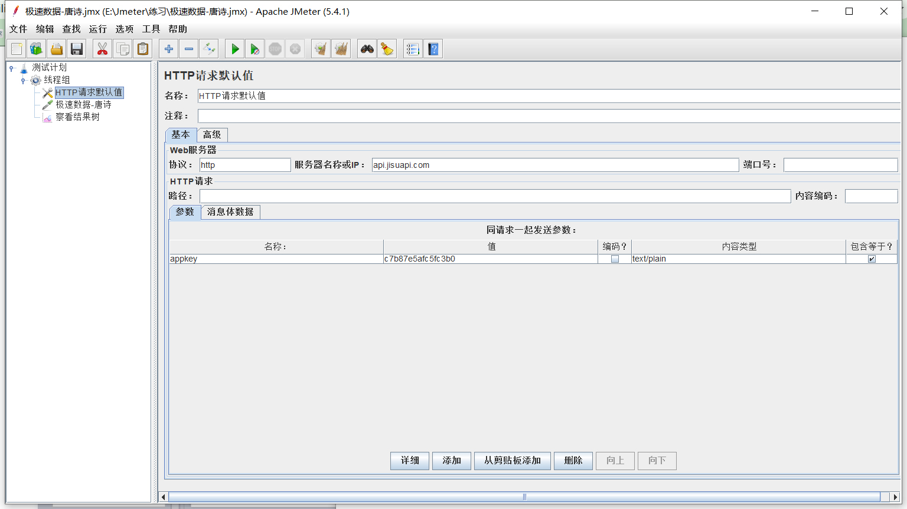

# Jmeter使用教程


## 命令行运行Jmeter

```
jmeter -n -t <testplan filename> -l <listener filename>
示例： jmeter -n -t testplan.jmx -l test.jtl


-h 帮助 -> 打印出有用的信息并退出
-n 非 GUI 模式 -> 在非 GUI 模式下运行 JMeter
-t 测试文件 -> 要运行的 JMeter 测试脚本文件
-l 日志文件 -> 记录结果的文件
-r 远程执行 -> 在Jmter.properties文件中指定的所有远程服务器
-H 代理主机 -> 设置 JMeter 使用的代理主机
-P 代理端口 -> 设置 JMeter 使用的代理主机的端口号

例如：jmeter -n -t test1.jmx -l logfile1.jtl -H 192.168.1.1 -P 8080
```


Http常见状态码：

```
200：成功，服务器已成功处理了请求。
201：已创建，请求成功并且服务器创建了新资源
202：已接受，服务器已接受请求，但尚未处理
203：非授权新奇，服务器成功处理请求，但返回信息可能来自另一端
204：无内容，服务器成功处理了请求，但没有返回任何内容
205：重置内容，服务器成功处理了请求，但没有返回任何内容
206：部分内容，服务器成功处理了部分GET请求 
```


## Http请求默认值

> 线程组 - 配置原件 - http请求默认值

```
配置相同的http、url、port、parames
```




## 查看结果树

> 配置原件 - 取样器 - 查看结果树

```
查看响应结果
```

