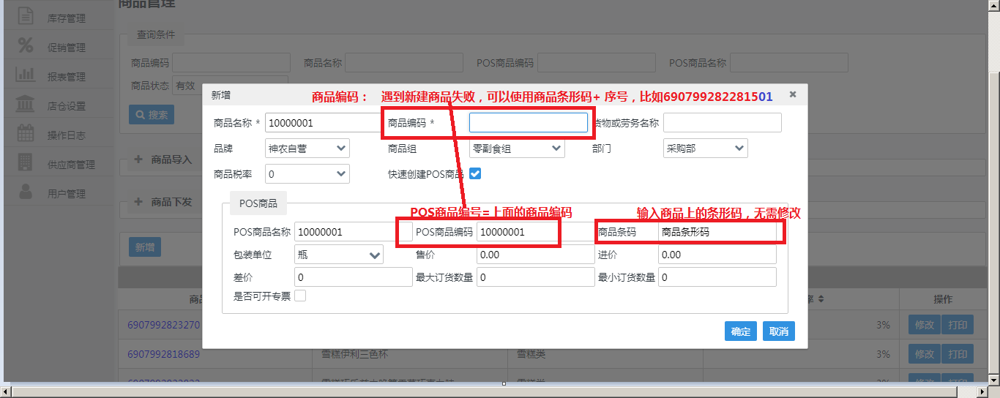

# 运维事宜


## 1、SNJ-配置销售小票打印两张

```
在BackStore上配置即可解决问题
BS > pos > 根据操作类型打印出 其中有个节点是self，点开配置number为2，即可打印两张小票
```


## 2、SNJ-诺诺支付与门店自营交易对账不平

``` 
诺诺报表商户订单编号规则：门店号+机台号+交易号+交易时间
例如：1108279513202104171657473012
门店：1108
机台号：2
交易号：79513
时间：202104171657473012	 

登录SNJ后台管理系统，拉出门店自营报表，与诺诺支付数据进行比对。
门店自营报表位置：admin后台 > 报表管理 > 销售报表
```


## 3、SNJ-pos没有优惠促销


```
问题是因为没有导数据导致的，通过脚本查询需要的数据，插入数据即可解决

查询脚本
select * from DomainAreaSpecificLiterals where szLanguageCode='zh-CN' and szDomainAreaKeyPart1='Sale.ManLineDiscount'
```


## 4、SNJ-打印的销售小票二维码比较大


```
网络问题导致的：

生成二维码和网络环境有关系，网络正常的时候是系统会把小票信息拼接为url地址，此时是可以正常开发票的，显示的是小二维码。如果网络环境比较差的时候，不会拼接开票地址，显示的就是大的二维码，扫描出现的应该是一个字符串
```


## 5、SNJ-价签打印格式错误


```
可以通过浏览器自带的打印配置调整打印的大小。

打印机配置与程序不匹配导致的。

补充：使用以上方式本地可行，在客户电脑不行。改问题最终是客户换了一台以前能够正常打印的电脑解决了。
```


## 6、SNJ-扫描商品二维码    扫付款码，提示发生内部错误。


```
根据查看日志，是在修改数量操作时，提示“发生内部错误”， 模拟了操作，大致是没有选中商品操作了修改数量，再扫码的时候会发生提示内部错误

可以尝试扫码的时候先点击一下左边的票据内的商品，再点一下输入条码的输入框，最后再扫描条码应该就可以了。
```


## 7、SNJ-禁止签退

```
通过修改注册表解决
HKEY_LOCAL_MACHINE\SOFTWARE\Wow6432Node\Wincor Nixdorf\TPDotnet\Pos\AutoTimeBreak

UseAutoTimeBreak的值true是可以自动签退，false不能签退
```


## 8、SNJ-pos系统和打印的小票不显示商品名称


```
数据库配置是根据商品描述的第二个描述项desc1取值的，修改数据库读取名称规则规则，改为desc解决
修改脚本：
update POSUIPresentationPiece set  szTAObjectCondition='ART.szDesc<>',szTAFormat='TAOBJECT(ART.szDesc)' 
where szPresentationID='Article_number_ALDI' and szPresentationPieceID='Article_desc';

update POSUIPresentationPiece set  szTAObjectCondition='ART.szDesc<>',szTAFormat='TAOBJECT(ART.szDesc)' 
where szPresentationID='ARTICLE_TOTAL' and szPresentationPieceID='ART_DESC';
```


## 9、SNJ-pos系统无法启动


```
TP服务没有开启导致的，开启服务，重启交通灯即可解决问题
```


## 10、SNJ-修改门店号

```
1、清机、重启
2、sql server执行清机存储过程
3、门店商品数据清空
4、中台重新下发商品数据
5、验证操作是否成功
```

```
1）清机执行命令：D:\TPDotnet\bin\TPReset Type=Server
1、点击“1.Step:Prepare Local POS Cleanup”，准备清机
2、点击“2.Step:Send Cleanup Mail to all FOS Systems”
3、点击“3.Step:Cleanup Server”，清理server测试数据
4、清机结束，显示”Cleanup TP.net is done”，选择确定
5、检查清机结果
	报表->销售数据->商品销售
	查询指定日期的商品销售报表（期望结果，无数据）
	报表->现金管理->账户资金移动
	查询现金管理资金移动报告（期望结果，无数据
6、重启电脑
```


```
2）修改门店号，执行脚本即可
```


```
3）删除商品三张数据表，
delete from POSIdentity
delete from Item
delete from ItemLookupCode
```

```
4）中台重新下发商品数据
```


## 11、SNJ-配置诺诺支付

```
1、Backstore > 主数据库维护 > web service配置 > nuonuo_pay 配置支付的相关参数
配置：
<Host Name>: 对应文档中部门 appkey/appsecret/token + ID,中间用“/”连接
用户名：对应文档中门店正式税号
```


## 12、SNJ-退货时提示“不能加载非xml或空文件”


```
该问题是pos目录该笔TA文件内容为空导致的， 从server目录获取该笔的TA文件复制至POS目录，重新退款即可解决。
```


## 13、SNJ-收银系统无法退款


```
该问题是因为5月1假期客流量较大，诺诺支付方api流量有限额导致的。
1、查看交易日志
2、定位问题原因
```

日志显示支付方式有限额，请求诺诺方协助处理，退款问题。


## 14、SNJ-无法新增商品

这个问题是因为其他门店新增了商品，商品的字段预估在数据库中是设置了唯一键，导致不能重复添加。

```
解决方案：
1、使用批量导入，可以新建成功。注意，该方法估计是update操作，会把之前已经创建的数据给覆盖掉，导致金额、库存、是新导入的数据，造成了数据覆盖。有风险。

2、新建商品的商品编码和Pos商品编码加个字符戳，可以解决该问题，推荐。操作如下图。
```



