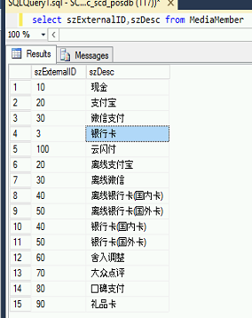
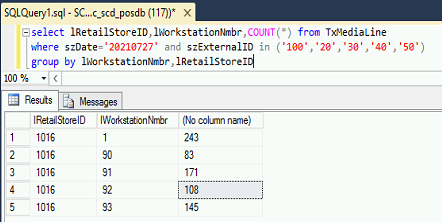
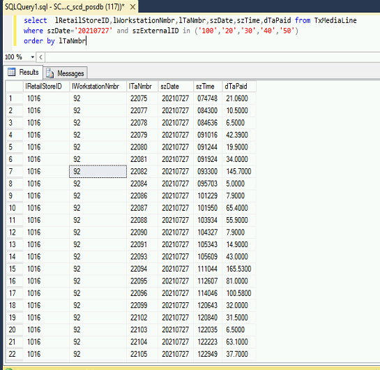

# 嘉利对账


## 1、与嘉利沟通需要核对的支付类型

一般为：支付宝、微信、云闪付、银行卡。获取对应支付类型的ID

```
查询sql

select szExternalID,szDesc from MediaMember
```




## 2、查询门店总交易笔数

先与嘉利核对差异门店

```
当天查询昨天sql：

select lRetailStoreID as N'门店',lWorkstationNmbr as N'POS号',COUNT(*) as '交易笔数',(CONVERT(varchar(100), GETDATE(), 112))-1 as '日期' from TxMediaLine 
where szDate=(CONVERT(varchar(100), GETDATE(), 112))-1 and szExternalID in ('100','20','30','40','50')
group by lWorkstationNmbr,lRetailStoreID
```




## 3、根据明细查询交易明细

```
当天查询昨天sql：

select  lRetailStoreID,lWorkstationNmbr,lTaNmbr,szDate,szTime,dTaPaid,szDate from TxMediaLine 
where szDate=(CONVERT(varchar(100), GETDATE(), 112))-1 and szExternalID in ('100','20','30','40','50')
order by lTaNmbr
```




## 4、根据TP交易号和嘉利商户订单号匹配差异单

```
例：嘉利商户订单号组成结构-1016902414920210727080206650-
门店：1016
pos号：90
交易号：24149
时间：20210727080206650
```


## 5、根据匹配的差异单据查询日志

分析日志是TP问题，还是嘉利问题

```
嘉利问题：
1、嘉利没有返回值
2、嘉利返回值不是00,00代表支付成功
```

