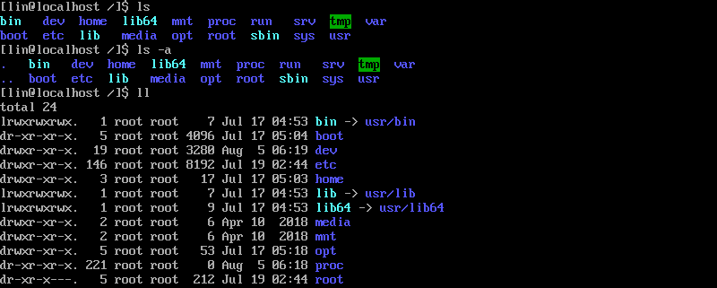
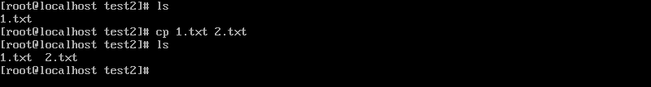
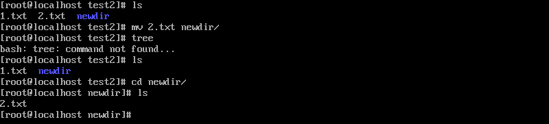
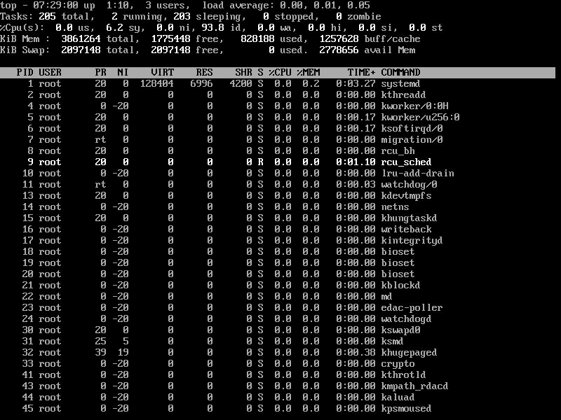
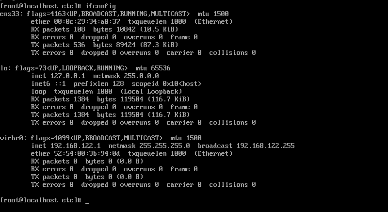

---
参考：https://www.cnblogs.com/laov/p/3541414.html#zhiling
---


### linux知识


#### 常用命令

> ls	显示文件或目录

- -l	[list]列出文件详细信息
  - 可直接输入ll
- -a   [all]列出当前目录下所有文件及目录，包括隐藏文件




> mkdir	创建目录

- -p	[parent]创建目录，如无父母了，创建p


> cd	切换目录


> touch	创建空文件


> echo	创建带有内容的文件


> cat	查看文件内容


> cp	拷贝



> mv	移动或重命名




> rm	删除文件

- -r	递归删除，可删除子目录及文件
- -f    强制删除


> find	搜索文件
>
> 引用：https://www.cnblogs.com/ultranms/p/9300530.html

```
-name   filename             #查找名为filename的文件
-perm                        #按执行权限来查找
-user    username             #按文件属主来查找
-group groupname            #按组来查找
-mtime   -n +n                #按文件更改时间来查找文件，-n指n天以内，+n指n天以前
-atime    -n +n               #按文件访问时间来查GIN: 0px">

-ctime    -n +n              #按文件创建时间来查找文件，-n指n天以内，+n指n天以前

-nogroup                     #查无有效属组的文件，即文件的属组在/etc/groups中不存在
-nouser                     #查无有效属主的文件，即文件的属主在/etc/passwd中不存
-newer   f1 !f2              找文件，-n指n天以内，+n指n天以前 
-ctime    -n +n               #按文件创建时间来查找文件，-n指n天以内，+n指n天以前 
-nogroup                     #查无有效属组的文件，即文件的属组在/etc/groups中不存在
-nouser                      #查无有效属主的文件，即文件的属主在/etc/passwd中不存
-newer   f1 !f2               #查更改时间比f1新但比f2旧的文件
-type    b/d/c/p/l/f         #查是块设备、目录、字符设备、管道、符号链接、普通文件
-size      n[c]               #查长度为n块[或n字节]的文件
-depth                       #使查找在进入子目录前先行查找完本目录
-fstype                     #查更改时间比f1新但比f2旧的文件
-type    b/d/c/p/l/f         #查是块设备、目录、字符设备、管道、符号链接、普通文件
-size      n[c]               #查长度为n块[或n字节]的文件
-depth                       #使查找在进入子目录前先行查找完本目录
-fstype                      #查位于某一类型文件系统中的文件，这些文件系统类型通常可 在/etc/fstab中找到
-mount                       #查文件时不跨越文件系统mount点
-follow                      #如果遇到符号链接文件，就跟踪链接所指的文件
-cpio                %;      #查位于某一类型文件系统中的文件，这些文件系统类型通常可 在/etc/fstab中找到
-mount                       #查文件时不跨越文件系统mount点
-follow                      #如果遇到符号链接文件，就跟踪链接所指的文件
-cpio                        #对匹配的文件使用cpio命令，将他们备份到磁带设备中
-prune                       #忽略某个目录
```


> wc	统计文本中的行数、字数、字符数


> grep	在文本中查找某个字符


> rmdir	删除空目录


> tree	树形结构显示目录，需安装tree包


> pwd	显示当前目录


> ln	创建链接


> more、less	分页显示文本文件内容


> ctrl + alt + F1 命令行全屏模式


#### 系统管理命令

> stat	显示指定文件的详细信息，比ls更详细


> who	显示在线登录用户


> whoami	显示当前操作用户


> hostname	显示主机名


> uname	显示系统信息


> top	动态显示当前耗费资源最多的进程信息



> ps	显示进程


> du	查看目录大小du -h[home]带有单位显示目录信息


> df	查看磁盘大小df -h带有单位显示信息


> ifconfig	查看网络状态



> ping 	查看网络情况


> netstat	显示网络状态信息


> man	命令不会用了，找男人	如：man	ls


> clear	清屏


> alias	对命令重命名 如：alias showmeit="ps -aux" ，另外解除使用unaliax showmeit


> kill	杀死进程，可以先用ps/top命令查看进程ID，然后用kill杀死进程

- kill 9	强制杀死


#### 打包压缩相关命令

> gzip	


> bzip2	


> tar	打包压缩

- -c	归档文件
- -x    压缩文件
- -z    gzip压缩文件
- -j     bzip2压缩文件
- -v    [view]显示压缩或解压缩过程
- -f    使用档名

```
例如：
tar -cvf /home/abc.tar /home/abc            只打包，不压缩
tar -zcvf /home/abc.tar.gz /home/abc        打包，并用gzip压缩
tar -jcvf /home/abc.tar.bz2 /home/abc       打包，并用bzip2压缩
当然，如果想解压缩，就直接替换上面的命令  tar -cvf  / tar -zcvf  / tar -jcvf 中的“c” 换成“x” 就可以了。
```


#### 关机/重启

> shutdown

- -r	关机重启
- -h    关机不重启
- now    立即关机


> halt	关机


> reboot	重启


#### Linux管道

将一个命令的标准输出作为另一个命令的标准输入。也就是把几个命令组合起来使用，后一个命令除以前一个命令的结果。

例：grep -r "close" /home/* | more    在home目录下所有文件中查找，包括close的文件，并分页输出。


#### Linux软件包管理

> **dpkg** (Debian Package)管理工具，软件包名以.deb后缀。这种方法适合系统不能联网的情况下。

比如安装tree命令的安装包，先将tree.deb传到Linux系统中。再使用如下命令安装。

- sudo dpkg -i tree_1.5.3-1_i386.deb     安装软件
- sudo dpkg -r tree                   			    卸载软件


注：将tree.deb传到Linux系统中，有多种方式。VMwareTool，使用挂载方式；使用winSCP工具等；

**APT**（Advanced Packaging Tool）高级软件工具。这种方法适合系统能够连接互联网的情况。

依然以tree为例

- sudo apt-get install tree             安装tree

- sudo apt-get remove tree            卸载tree

- sudo apt-get update                 更新软件

- sudo apt-get upgrade     


#### vim使用

> vim三种模式：命令模式、插入模式、编辑模式。使用==ESC==或==i==或==:==切换模式

命令模式下：

- :q	退出
- :ql    强制退出
- :wq    保存并退出
- :set number    显示行号
- :set nonumber    隐藏行号
- /apache    在文档中查找apache 按n跳到下一个，shift+n上一个
- yyp    复制光标所在行，并粘贴
- h(左移一个字符←)、j(下一行↓)、k(上一行↑)、l(右移一个字符→)


#### 用户及用户组管理

/etc/passwd   存储用户账号

/etc/group    存储组账号

/etc/shadow   存储用户账号的密码

/etc/gshadow  存储用户组账号的密码

useradd 用户名

userdel 用户名

adduser 用户名

groupadd 组名

groupdel 组名

passwd root   给root设置密码

su root

su - root 

/etc/profile   系统环境变量

bash_profile   用户环境变量

.bashrc        用户环境变量

su user        切换用户，加载配置文件.bashrc

su - user       切换用户，加载配置文件/etc/profile ，加载bash_profile


#### **更改文件的用户及用户组**

sudo chown [-R] owner[:group] {File|Directory}

例如：还以jdk-7u21-linux-i586.tar.gz为例。属于用户hadoop，组hadoop

要想切换此文件所属的用户及组。可以使用命令。

sudo chown root:root jdk-7u21-linux-i586.tar.gz

 

#### **文件权限管理**

三种基本权限

R      读     数值表示为4

W      写     数值表示为2

X      可执行  数值表示为1


如图所示，jdk-7u21-linux-i586.tar.gz文件的权限为-rw-rw-r--

-rw-rw-r--一共十个字符，分成四段。

第一个字符“-”表示普通文件；这个位置还可能会出现“l”链接；“d”表示目录

第二三四个字符“rw-”表示当前所属用户的权限。  所以用数值表示为4+2=6

第五六七个字符“rw-”表示当前所属组的权限。    所以用数值表示为4+2=6

第八九十个字符“r--”表示其他用户权限。        所以用数值表示为4

所以操作此文件的权限用数值表示为664 


#### **更改权限**

sudo chmod [u所属用户  g所属组  o其他用户  a所有用户]  [+增加权限  -减少权限]  [r  w  x]  目录名 

例如：有一个文件filename，权限为“-rw-r----x” ,将权限值改为"-rwxrw-r-x"，用数值表示为765

sudo chmod u+x g+w o+r  filename

上面的例子可以用数值表示

sudo chmod 765 filename